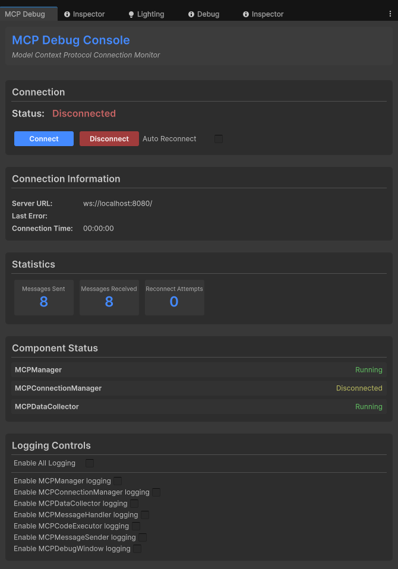

# Unity MCP Integration 

This package provides a seamless integration between [Model Context Protocol (MCP)](https://modelcontextprotocol.io/) and Unity Editor, allowing AI assistants to understand and interact with your Unity projects in real-time. With this integration, AI assistants can access information about your scene hierarchy, project settings, and execute code directly in the Unity Editor context.

## 📚 What is MCP?

The Model Context Protocol (MCP) is a standardized protocol that connects AI models to tools and context sources. It enables AI assistants to:

- Access real-time information about your Unity project
- Understand your scene hierarchy and game objects
- Execute C# code directly in the Unity Editor
- Monitor logs and errors
- Control the Editor's play mode

Learn more about MCP:
- [MCP Introduction](https://modelcontextprotocol.io/introduction)
- [MCP Server Documentation](https://modelcontextprotocol.io/quickstart/server)
- [MCP Client Documentation](https://modelcontextprotocol.io/quickstart/client) 
- [MCP Tools Concepts](https://modelcontextprotocol.io/docs/concepts/tools)

## 🚀 Getting Started

### Prerequisites

- Unity 2021.3 or later
- Node.js 18+ (for running the MCP server)

### Installation

#### 1. Import the Unity Package

Import the Unity package into your project:

1. Clone this repository or download it as a zip
2. In Unity, go to `Assets > Import Package > Custom Package`
3. Select the `UnityMCPConnection.unitypackage` file

#### 2. Set up the MCP Server

You have two options to run the MCP server:

**Option A: Run the server directly**

1. Navigate to the `mcpServer` directory
2. Install dependencies:
   ```
   npm install
   ```
3. Run the server:
   ```
   node build/index.js
   ```

**Option B: Add to MCP Host configuration**

Add the server to your MCP Host configuration for claude Desktop, Custom Implementation etc

```json
{
  "mcpServers": {
    "unity-mcp-server": {
      "command": "node",
      "args": [
        "<path-to-project>/mcpServer/build/index.js"
      ]
    }
  }
}
```

### 🔧 Usage

#### Debugging and Monitoring

You can open the MCP Debug window in Unity to monitor the connection and test features:

1. Go to `Window > MCP Debug`
2. Use the debug window to:
   - Check connection status
   - Test code execution
   - View logs
   - Monitor events

#### Available Tools

The Unity MCP integration provides several tools to AI assistants:

- **get_editor_state**: Get comprehensive information about the Unity project and editor state
- **get_current_scene_info**: Get detailed information about the current scene
- **get_game_objects_info**: Get information about specific GameObjects in the scene
- **execute_editor_command**: Execute C# code directly in the Unity Editor
- **get_logs**: Retrieve and filter Unity console logs

## 🛠️ Architecture

The integration consists of two main components:

1. **Unity Plugin (C#)**: Resides in the Unity Editor and provides access to Editor APIs
2. **MCP Server (TypeScript/Node.js)**: Implements the MCP protocol and communicates with the Unity plugin

Communication between them happens via WebSocket, transferring JSON messages for commands and data.

## 👥 Contributing

Contributions are welcome! Here's how you can contribute:

1. Fork the repository
2. Create a feature branch (`git checkout -b feature/amazing-feature`)
3. Make your changes
4. Commit your changes (`git commit -m 'Add some amazing feature'`)
5. Push to the branch (`git push origin feature/amazing-feature`)
6. Open a Pull Request

### Development Setup

**Unity Side**:
- Open the project in Unity
- Modify the C# scripts in the `UnityMCPConnection/Editor` directory

**Server Side**:
- Navigate to the `mcpServer` directory
- Install dependencies: `npm install`
- Make changes to the TypeScript files in the `src` directory
- Build the server: `npm run build`
- Run the server: `node build/index.js`

## 📄 License

This project is licensed under the MIT License - see the LICENSE file for details.

## 📞 Support

If you encounter any issues or have questions, please file an issue on the GitHub repository.